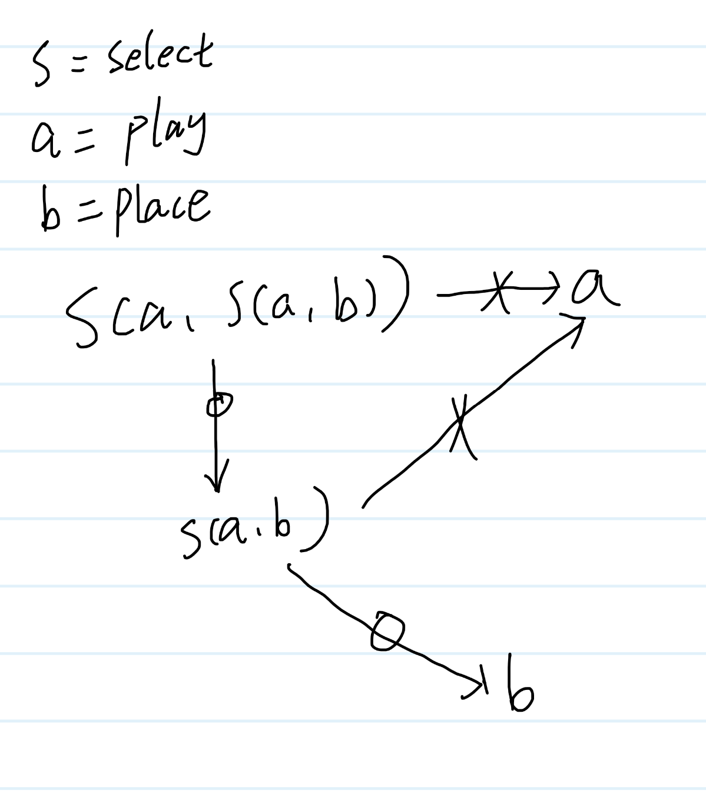
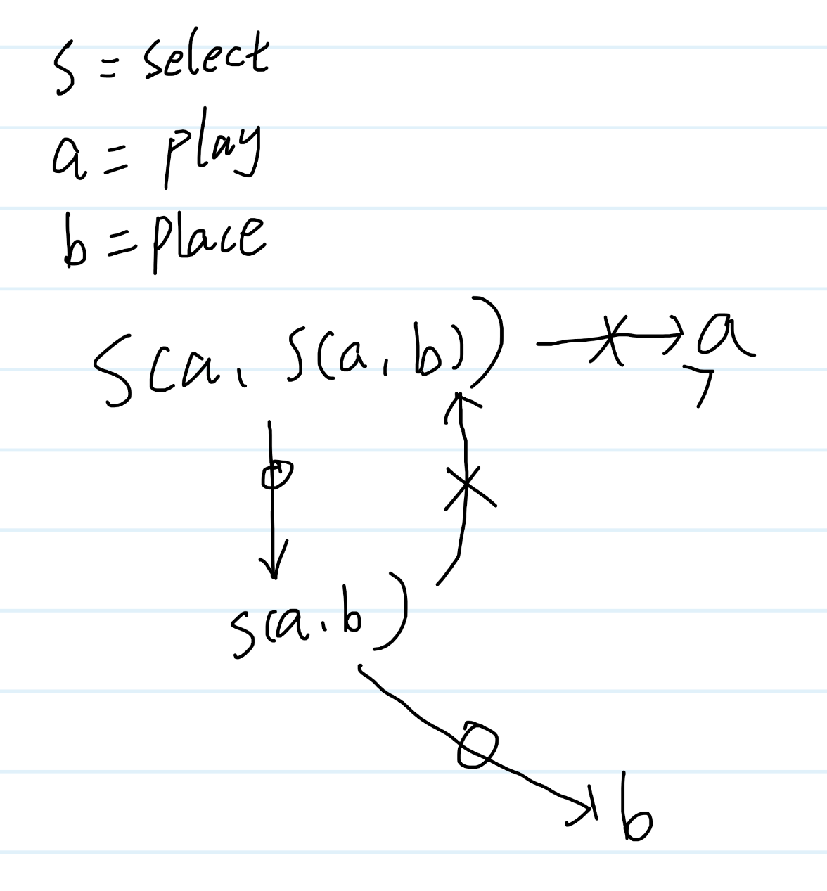
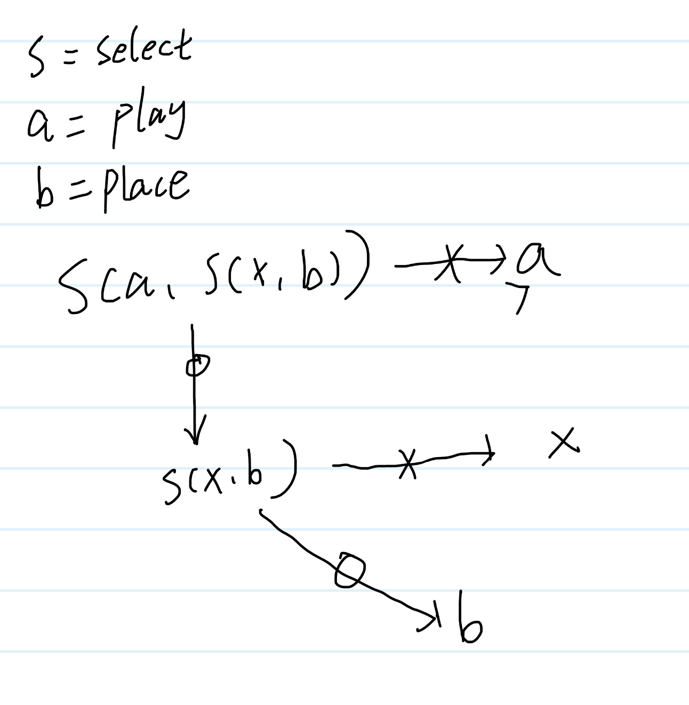
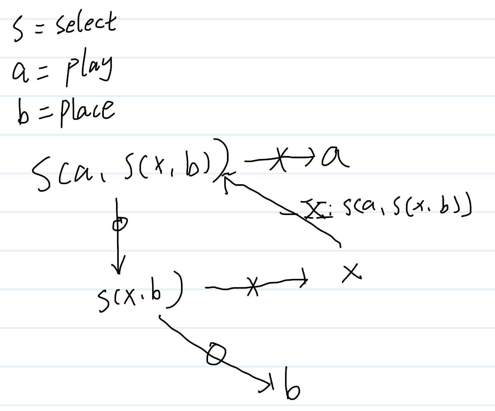
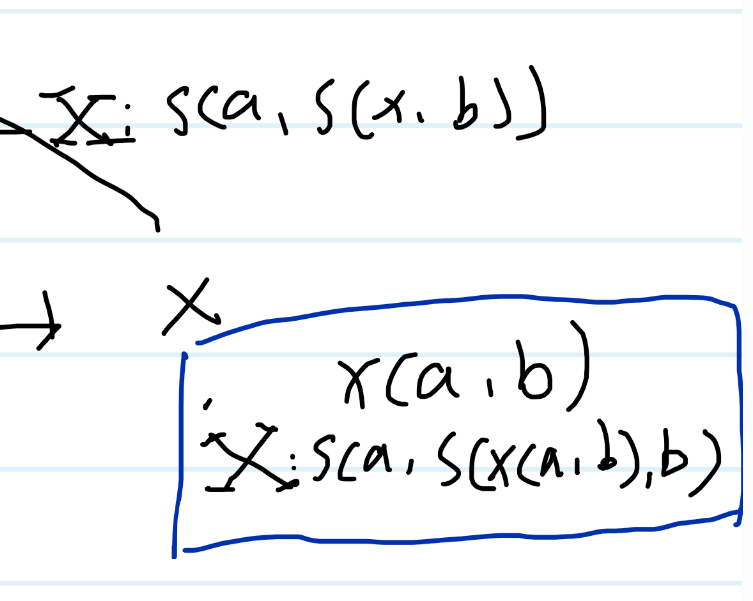
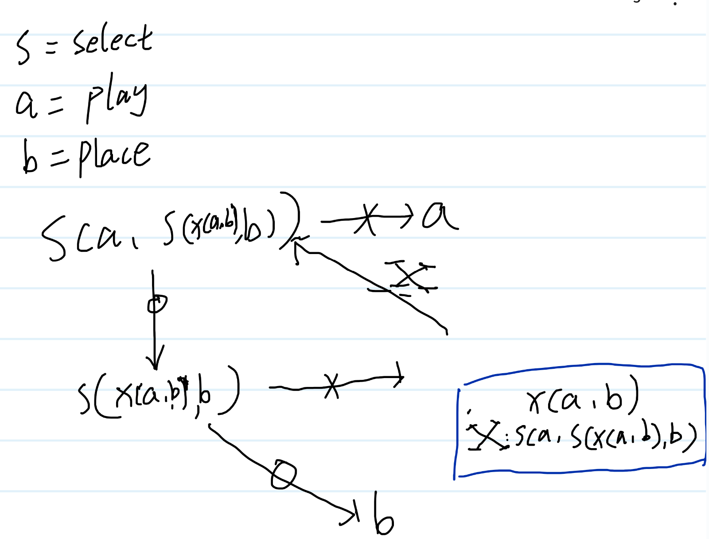
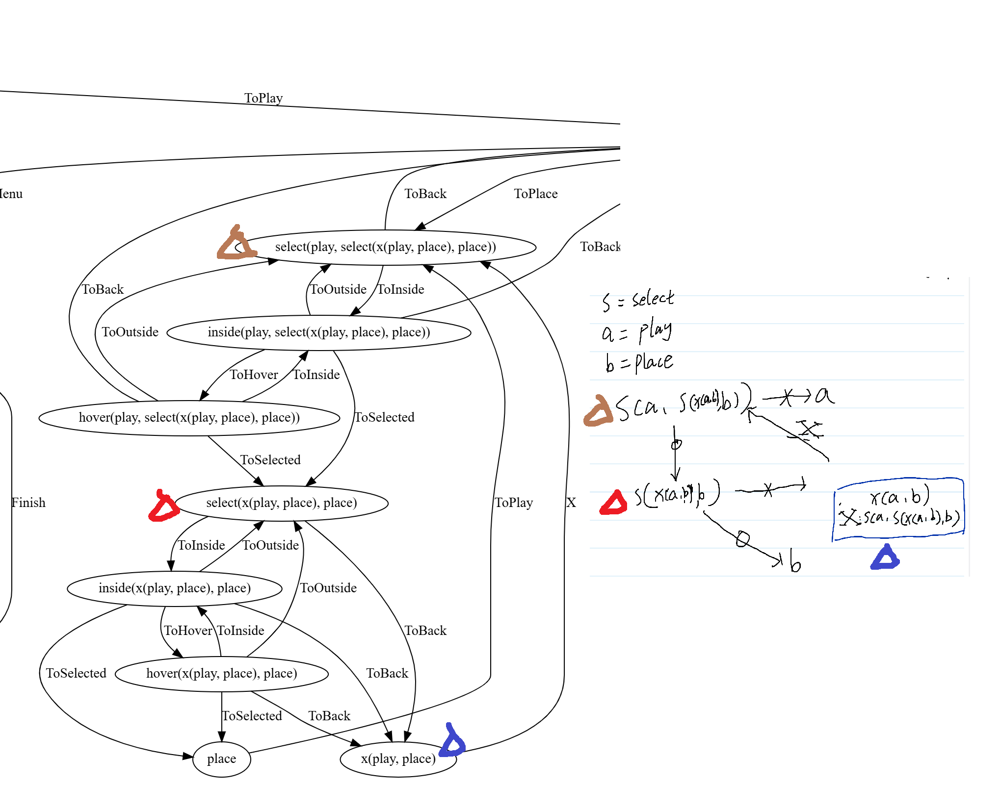

## How to Properly Use Polystate?
The correct way to use polystate is: reason about program behavior through symbols, then transform these symbols into code.

This might sound bewildering, but don't worry - I'll explain this process through concrete examples.

## Background Knowledge

What is polystate? [Here's a detailed introduction](https://github.com/sdzx-1/polystate?tab=readme-ov-file#polystates-core-design-philosophy).

In short: Finite State Machines are a powerful programming pattern, and when combined with composability and type safety, they become an even more ideal programming paradigm. The polystate library was designed with this goal in mind.

I've been designing this library for some time and have used it in this experimental project. However, it wasn't until recently that I discovered the proper way to use polystate, fortunately before it could overwhelm me. I can't contain my excitement, which is why I wrote this article!

Let's begin!

## Two-Stage Selection
Using raylib, I implemented a generic "selection" semantic: interactive selection through mouse interaction.

The selection behavior is composed of three generic states (select, inside, hover) and ten related messages.

These states and messages implement: selecting an element with the mouse and how to respond to mouse hover events.

An interesting example in this project is "two-stage selection": you need to first select a building, then select a grid position to place it, where the building selection constrains the position selection.


This semantic can be concisely expressed as:

```zig
ToPlay: Wit(.{ Example.select, Example.play, .{ Example.select, Example.play, Example.place } }),
```

This code succinctly describes our intent. But if you look at the state diagram, you'll find that it corresponds to quite complex state transitions.


Through simple declarations, we've nested and reused complex "selection" semantics - this is a huge victory!

## New Requirements

```zig
ToPlay: Wit(.{ Example.select, Example.play, .{ Example.select, Example.play, Example.place } }),
```

If we think of selection as a function, the above code can be represented as: `select(play, select(play, place))`. From a functional perspective, the first parameter of the select function indicates the state to enter when selection is abandoned, and the second parameter indicates the state to enter when the correct thing is selected.

Let me use the diagram below to illustrate `select(play, select(play, place))`, where crossed arrows represent abandoning selection and circled arrows represent selecting something. Note the meaning of select's first and second parameters.



For convenience in the following discussion, I'll use s, a, b to represent the states select, play, place respectively.
We can notice that whether it's the first or second time, when we abandon selection, we always enter state a.

Now my new requirement is that when abandoning the second selection, I want to return to the first selection state, rather than directly entering state a. This means: after I select a building and then select a position, if I change my mind during position selection, I want to go back to building selection rather than exiting the selection state entirely.

The corresponding state diagram is as follows:


## Infinite States

Looking at the state diagram, our problem seems solved? But wait! Remember:

`The first parameter of the s function indicates the state to enter when selection is abandoned, and the second parameter indicates the state to enter when the correct thing is selected. Crossed arrows represent abandoning selection, and circled arrows represent selecting something.`

Notice the first parameter of the second selection. According to the above correspondence, we get `a = s(a, s(a, b))`. What is this? Part equals the whole? Is this possible? If we had an infinite state machine, we could do this. Unfortunately, we have a finite state machine, and while polystate might be able to express such meaning, [the result would be that the zig compiler never terminates](https://github.com/ziglang/zig/issues/24251).

## Runtime Loop

So how do we achieve our goal: returning to the first selection from the second selection?

Let's stare at this state diagram again:


The first and second selections form a loop. Let's introduce a third state x, replacing all `s(a,b)` with `s(x, b)`. This means that abandoning the second selection will enter state x.



Then how do we get from x back to `s(a, s(x,b))`? We just need a message X in state x, where this message points to the state `s(a, s(x,b))`. What is this message? Its meaning is similar to the crossed or circled arrows. This behavior requires no trigger conditions - as soon as state x is entered, message X is automatically triggered, returning to state: `s(a, s(x,b))`.



By introducing a new state, we've fulfilled the user's requirement.

And this is the actual code: [code](https://github.com/sdzx-1/ray-game/commit/8d3262ee68972629a04564c38e9fcedd4986e2c1)

```zig
pub const xST = union(enum) {
    X: Wit(.{ Example.select, Example.play, .{ Example.select, Example.x, Example.place } }),

    pub fn conthandler(gst: *GST) ContR {
        switch (genMsg(gst)) {
            .X => |wit| {
                return .{ .Curr = wit.conthandler() };
            },
        }
    }

    pub fn genMsg(gst: *GST) @This() {
        _ = gst;
        return .X;
    }
};
```

The code is almost identical to our reasoning - how cool is that? We arrived at the correct code through reasoning.

## The Power of Abstraction

We've fulfilled the user's requirement, now let's try something more interesting.

Let's generalize x by turning it into a function that takes two parameters a and b. The content in the blue box below shows this generalization process:



What is generalization? What does it mean? From the diagram, it looks like just symbol substitution, replacing x with x(a,b). What's the actual effect of this? I've expanded the scope of state x's usage - previously it could only be used with specific a and b states, but now a and b can be any states.



And here's the actual code: [code](https://github.com/sdzx-1/ray-game/commit/9646bc3c0f1c11314aafbc7ca45436a07283e802)

```zig
pub fn xST(back: SDZX, target: SDZX) type {
    return union(enum) {
        X: WitRow(SDZX.C(.select, &.{ back, SDZX.C(.select, &.{ SDZX.C(.x, &.{ back, target }), target }) })),

        pub fn conthandler(gst: *GST) ContR {
            switch (genMsg(gst)) {
                .X => |wit| {
                    return .{ .Curr = wit.conthandler() };
                },
            }
        }
        // ... other code ...
    };
}
```

This kind of code is very difficult to understand and write just by reading the code. Therefore, when we build complex state machines through composition, using symbolic reasoning to understand code and implement requirements is the correct approach.

Let me compare our abstract representation with the actual state machine:



Notice the correspondence here!

The power that compositional semantics gives us is: we can analyze and write code at a highly abstract level, and composability automatically expands it into complex state machines.

Finally, thank you readers for your patience in reading this far. Let's see this code in action! (This is a gif image, it might take some time to load)

 
