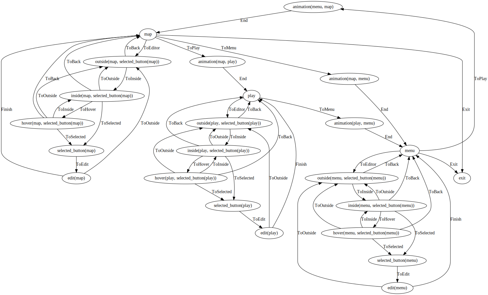

# ray-game
This project is an experiment: building a game with polystate to showcase its advantages and practical usage.

**I used this project to explore the limits of polystate, it is not suitable for users who are new to polystate!**

The core idea is to integrate the game editor with the game itself, making it easy to modify the game interface directly.

This approach leads to complex states, but with polystate, I can easily manage them all.

Some interesting highlights so far:
1. Generic states greatly simplify the program. For example, selecting targets with the mouse is a common operation—we abstracted it into a reusable "select" state and used it in at least 8 places.
2. Combining types to express action composition significantly improves the program's modularity. I discovered a way to combine state machine states—a new coding approach.

# discord
https://discord.gg/SWjPcCbT
