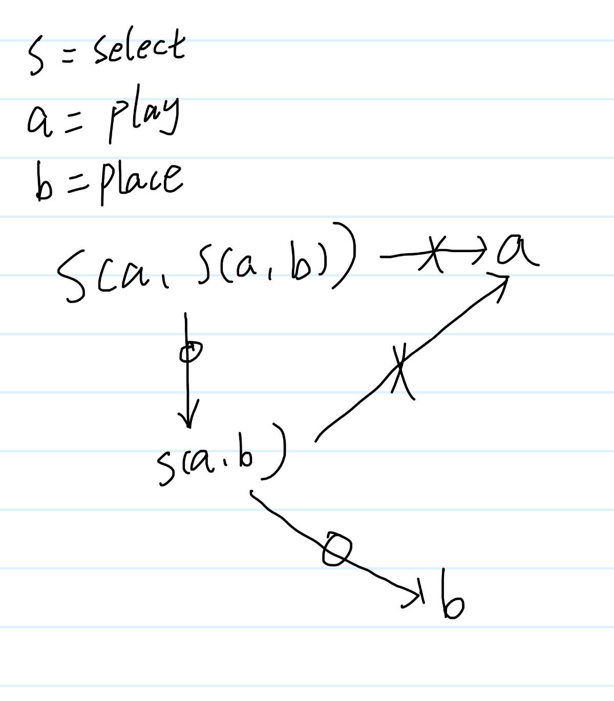
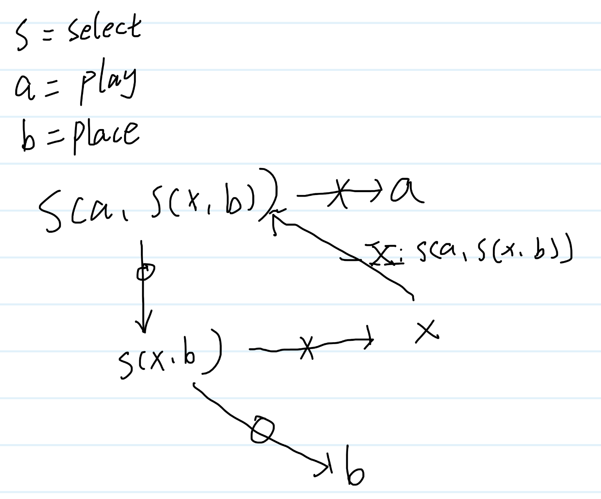
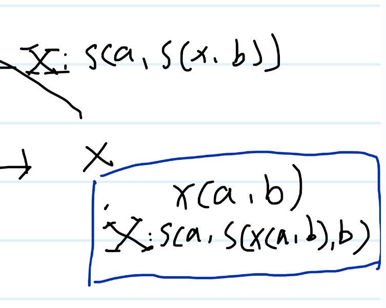

## 如何正确使用polystate？
正确使用polystate的方式是：通过符号推理程序行为，再将符号转化为代码。

听着可能匪夷所思，别担心我将通过具体的例子来完整的解释这个过程。

## 背景知识

什么是polystate？[这里有详细的介绍](https://github.com/sdzx-1/polystate?tab=readme-ov-file#polystates-core-design-philosophy). 

简而言之：有限状态机是一种非常强大的编程模式，如果再加上组合性和类型安全，它将成为一种更理想的编程范式。polystate 库正是为此目标而设计。

我设计了这个库有一段时间，并且也用它写了这个实验性的项目。但是直到最近，我才发现polystate的正确用法，所幸我没有被他吞噬。我无法抑制我的激动的心情，因此才有了这篇文章！

让我们开始吧！
## 两阶段选择
我使用raylib实现了一个通用的"选择"语义：通过鼠标进行交互式选择。

选择的具体行为由三个通用状态（select、inside、hover）和相关的十个消息共同构成。

这些状态和消息实现了：通过鼠标选择一个元素，以及鼠标悬停时应该如何响应。

这个项目中一个有趣的例子是"两阶段选择"：你需要先选择一个建筑，再选择一个网格位置来放置它，同时建筑的选择会限制位置的选择。


这样的语义可以简洁地表达为：

```zig
    ToPlay: Wit(.{ Example.select, Example.play, .{ Example.select, Example.play, Example.place } }),
```
这段代码极其简洁地描述了我们的意图。但如果你查看状态图，会发现它实际对应的状态转换相当复杂。


通过简单的声明，我们嵌套地复用了复杂的"选择"语义，这是巨大的胜利！

## 新的需求

```zig
 ToPlay: Wit(.{ Example.select, Example.play, .{ Example.select, Example.play, Example.place } }),
```
如果把选择看成函数，那么上面的代码表示为：select(play, select(play, place)), 我们从函数角度理解，select函数的第一个参数表示当你放弃选择后进入的状态，第二个参数表示你选择了正确的东西会进入的状态。
让我用下面的图展示 select(play, select(play, place)) 的含义，用带叉的箭头表示放弃选择，带圈的箭头表示选中某种东西。注意select第一个，第二个参数的含义。

为了叙述方便，在后面的文章中，我会用s，a，b来代称select， play， place的状态。
我们可以注意到，不论第一次，还是第二次 当我放弃选择时我都会进入a状态。

现在我的新需求是在第二次选择中放弃时，想返回第一次选择的状态，而不是直接进入a状态。这代表的含义是：我先选择一个建筑，再选择位置，当我选位置的时候我反悔了想再重新选择建筑，而不是直接退出选择状态。

对应的状态图如下：


## 无限状态

从按照状态图来说我们的问题似乎解决？但是等等！回想一下：

`s函数的第一个参数表示当你放弃选择后进入的状态，第二个参数表示你选择了正确的东西会进入的状态。用带叉的箭头表示放弃选择，带圈的箭头表示选中某种东西。`
注意第二次选择的第一个参数，根据上面的对应关系，于是我们得到了 `a = s(a, s(a, b))` ，这是什么？ 部分等于整体？ 这能做到吗？ 如果我们是无限状态机，那么我们可以做到。可惜我们是有限状态机，通过polystate 或许可以表达这样的含义，[但结果就是zig 编译器永不停机](https://github.com/ziglang/zig/issues/24251).

## 运行时循环

那我们该如何达到目的：从第二次选择返回第一次选择？

让我们再次凝视这个状态图：

第一次选择和第二次选择构成了循环。让我们引入第三个状态x，将所有的s(a,b) 替换成s(x, b).这表示在第二次选择中放弃时会进入状态x。 

那么如何再从x 回到 s(a, s(x,b))呢？只需要x状态下有一条消息X，这条消息所指向的状态是 s(a, s(x,b))。 那么消息是什么，它的含义类似于带圈或者带叉的箭头。这是这个行为不需要任何触发条件，只要进入状态x，自动触发消息X，从而返回状态：s(a, s(x,b)).


通过引入新的状态，我们完成了用户的需求。

而这也是实际的代码：[code](https://github.com/sdzx-1/ray-game/commit/8d3262ee68972629a04564c38e9fcedd4986e2c1)

```zig
pub const xST = union(enum) {Add commentMore actions
    X: Wit(.{ Example.select, Example.play, .{ Example.select, Example.x, Example.place } }),

    pub fn conthandler(gst: *GST) ContR {
        switch (genMsg(gst)) {
            .X => |wit| {
                return .{ .Curr = wit.conthandler() };
            },
        }
    }

    pub fn genMsg(gst: *GST) @This() {
        _ = gst;
        return .X;
    }
};
```
代码和我们推理的几乎一样，这太酷了，我们通过推理得到了正确的代码。

## 抽象的力量

我们已经完成了用户的需求，可以尝试一点更有意思的内容了。

让我泛化x，将它变成一个函数，同时需要两个参数a，b。下图中蓝色方框中的内容。



？？？什么是泛化？泛化是什么意思？从图片看只是做了符号替换，把x换成了x(a,b). 这么做的实际效果是什么？ 我扩大了x状态的使用范围，之前是只能在特定的a，b状态下才能用。而现a，b可以是任意状态。


同样这也是实际的代码：[code](https://github.com/sdzx-1/ray-game/commit/9646bc3c0f1c11314aafbc7ca45436a07283e802)

```zig
pub fn xST(back: SDZX, target: SDZX) type {
    return union(enum) {Add commentMore actions
        // X: Wit(.{ Example.select, Example.play, .{ Example.select, Example.x, Example.place } }),
        X: WitRow(SDZX.C(.select, &.{ back, SDZX.C(.select, &.{ SDZX.C(.x, &.{ back, target }), target }) })),

        pub fn conthandler(gst: *GST) ContR {
            switch (genMsg(gst)) {
                .X => |wit| {
                    return .{ .Curr = wit.conthandler() };
                },
            }
        .....

```

面对这样的代码，如果只通过阅读代码就非常难理解了，同时也非常难写。因此当我们通过组合构建复杂状态机的时候，通过符号推理来理解代码和实现需求才是正确的方式。

让我对比一下我们抽象的表示和实际的状态机。


注意这里的对应关系!

组合语义赋予我们的能力是：在非常抽象的层次分析和书写代码，组合性自动将它扩充成复杂的状态机。

最后，感谢有耐心看到这里的读者，让我们一起看看这个代码运行起来的效果吧！(这是一个gif图像，可能需要一点时间加载)。


